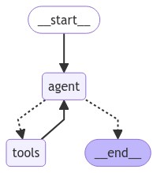

# Multi-retrieval agent
Most conversational AI agent samples are based on a very simple retrieval scenario where the user is querying over a single dataset, which typically lives in a vector DB for similarity search.

In real world scenarios, it is more common to have multiple sets of structured and unstructured data that the user wants to query. This repository is an example of how to set up a simple multi-retrieval agent that can make its own decisions on which datasets to query, which can then be reasoned over by an LLM.

## The LangChain framework
[LangChain](https://python.langchain.com/v0.2/docs) is a popular framework for developing applications that are powered by LLMs, such as conversational AI agents. This "application" uses LangChain to simplify the process of defining and querying data stores, as well as dynamically selecting RAG retrieval sources based on the user prompt.

[LangGraph](https://langchain-ai.github.io/langgraph) builds upon LangChain and allows the composition of multi-agent graphs.

## Using Agents and Tools
As a RAG application grows more complex, it needs to accommodate chat history and multiple sources of information that the user can query. Tools allow us to define those data sources with sufficient descriptors that an LLM can make decisions on which (if any) Tools to use to retrieve relevant data to augment a response to the user. 

A graph is a LangGraph concept that creates a loop where the LLM can:
- Reason over a user query and extract relevant information
- Review its tools and select the most relevant tool
- Run the tool and incorporate its result back into the LLM prompt
- Repeat until a certain condition has been reached

The graph defined in this notebook is as follows:

## Solution components
- Azure OpenAI Service: this solution is currently using Azure OpenAI Service to deploy the `GPT-4o` and `text-embedding-3-small` models for use by LangChain
- FAISS: to mock similarity search, FAISS is used as an in-memory vector store

## Running the `agent.ipynb` notebook
Copy the `.env.template` file to `.env` and fill in the appropriate variables. This requires setting up a LLM and Embedding model deployments in an Azure OpenAI Service.

Run the notebook to set up the in-memory vector store, load an LLM and run multiple queries against a conversational agent.
